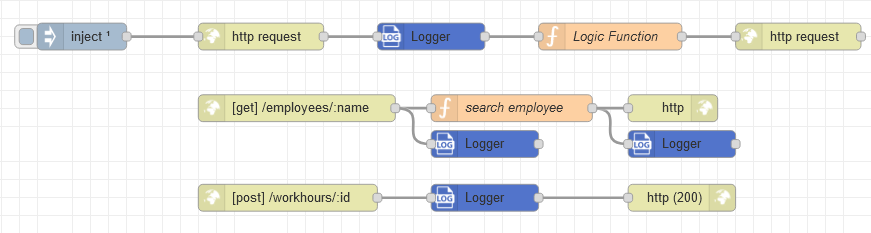

# Node-RED Payload-Logger

The Payload-Logger is a help in analysing data when, for example, an error has to be found.
The reason for this is that a new file is created for each log entry.
The individual logs can be stored in a folder depending on the subject for example one for incoming data and another for
outgoing data.
Or specific data of the msg object can be stored at different steps of a flow.
This makes it clearer and easier to search.

With the Config, the logs can be cleaned up because there can be an extremely large amount of data.
Because this function of the archiving process is so cool, you can define as many paths as needed.

### Example

Here is an example with different use cases of the Payload-Logger:

[Show File](examples/http-example/flow.json)

---

## Pre-requisites

The Node-RED Logger required [Node-RED](https://nodered.org/) to be installed

---
To install the Payload-Logger use the `Menu - Manage palette` option and search for `node-red-payload-logger`
,or run the following command in your Node-RED user directory - typically `~/.node-red`

```shell
npm i node-red-payload-logger
```

After restarting Node-RED your Payload-Logger is available in the palette on the left side.

---

## Logger

The Logger logs the input in a customized folder archives Files after a specific time.
Individual paths can be defined for the different log data. This makes the logs clearer.

### Details

#### Config

In Config, log paths can be defined in which old files are archived or deleted.

#### Action

The logged value can be written to a new file or appended to the existing file.   
If `Append` is selected its possible to select that every payload is written to a new line

#### Max. Filesize

If `Append` is selected the maximum filesize can be set to KB, MB or GB. When the file reaches the file size, a new file
is created with the same name and an index number.

#### Log Value

Either the payload can be logged or it is defined via JSONata what is to be logged.

### Path Creation

There are some Configuration for this Payload-Logger. Either the configs can be made with the editor dialogue or the
configs are sent with the msg object.
These are the Configurations:

- Folder
- Prefix/type
- Identifier
- extension

The logged data is stored in a defined file in a specific folder. The structure looks like this:
When new file is selected:  
`PAYLOAD_LOGS_PATH/{folder}/{prefix}_{identifier}_msgid.{extension}`
When Append is selected:  
`PAYLOAD_LOGS_PATH/{folder}/{prefix}_{identifier}{yyyy-MM-dd}.{extension}`  
When a new file is created with the Nodeid:   
`PAYLOAD_LOGS_PATH/{folder}/{prefix}_{identifier}{yyyy-MM-dd}_node-{Nodeid}.{extension}`

#### PAYLOAD_LOGS_PATH

The PAYLOAD_LOGS_PATH is an Environment variable for the log folder. It can be defined in the settings.js file. If this
variable is not defined the default value is taken `./logs`

#### Folder

The logged data is stored in this folder.

#### Prefix/Type

The prefix is the first part of the file name in which the logged data is stored.

#### Identifier

The identifier is the second part of the file name. It is defined via JSONata. It does not have to be defined.

#### File extension

The file extension can be selected via a dropdown menu. You can choose between json, html, xml, txt, csv and
self-selectable extension.

#### Write To

The logged Data can be written to the debug window or to the system console

## Config

Logs the input in a customized folder and archives Files after a specified time.

### Log Config

The Log Config automatically archives or deletes files after a specific date. The Log Path is the path where the files
are checked to see if they should be archived. The archived files are stored in the Archive Path and deleted after the
defined time. The time of execution can be selected manually. Archiving is executed every day at this time.

### Required

The Log Path is required. The other fields are not required. However, if the Archive Path or Archive after x days is
defined, the other must also be set. If the Delete after x days is defined, all fields are required. If the Executing
Time is not defined the default value is 00:00.

## Dev

### Run the contrib in your node-red

Create a link of the contribution in your dev-dir:

```shell
cd ./node-red-payload-logger
yarn link
```

Link the package in your gateway project:

```shell
cd ../your-node-red-repo
yarn link node-red-payload-logger
```

Restart your gateway after each change in the contribution code.

## Todos

Add Debug mode in Config to write messages to the debug window.

## References

- The way the data is written to the files is inspired
  by [Node-RED Core Node "write file"](https://github.com/node-red/node-red/blob/master/packages/node_modules/%40node-red/nodes/core/storage/10-file.js)
- The dynamic Setting in the Config node is inspired
  by [Node-RED modbus Flex-Sequencer](https://github.com/BiancoRoyal/node-red-contrib-modbus/blob/master/src/modbus-flex-sequencer.html)
